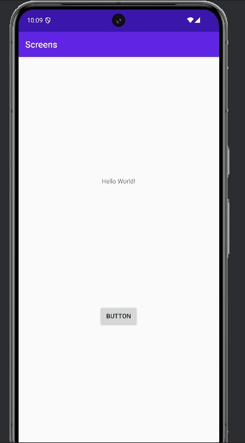
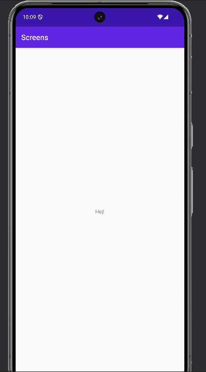

# Rapport Oskar Steise

- Skapade en ny activity och döpte den till SecondActivity

- Skapade en knapp i MainActivity
- Jag lokaliserade sedan ihop dess ID och skapade en clickListener
- Lade till en intent som körs när knappen klickas för att öppna SecondActivity
- Lade till data i en putExtra metod för att skicka med till den andra aktiviteten, vilket innebär att en text-sträng med ordet "Hej" skickas till SecondActivity när den öppnas

```
// hitta knappen
Button button = findViewById(R.id.main_activity_button);

button.setOnClickListener(new View.OnClickListener() {
        @Override
        public void onClick(View view) {
            // skapa en intent för att öppna SecondActivity
            Intent intent = new Intent(MainActivity.this, SecondActivity.class);

            // lägg till data i intent
            intent.putExtra("message", "Hej!");

            // starta SecondActivity
            startActivity(intent);
        }
    });
```


- Lade till en TextView i SecondActivity
- Hittade TextView ID:et, och hämtade strängen som skickades och satte dess text i den hämtade TextViewen i SecondActivity.java
```
        // hitta textview
        TextView textView = findViewById(R.id.second_activity_textview);

        // hämta den skickade strängen
        String message = getIntent().getStringExtra("message");

        // sätt texten i textview
        textView.setText(message);
```

På bilderna nedanför ser man först den första activityn som visas när appen laddas och den andra är den man kommer till när man klickar på den enkla knappen med texten 'Button' på. 




